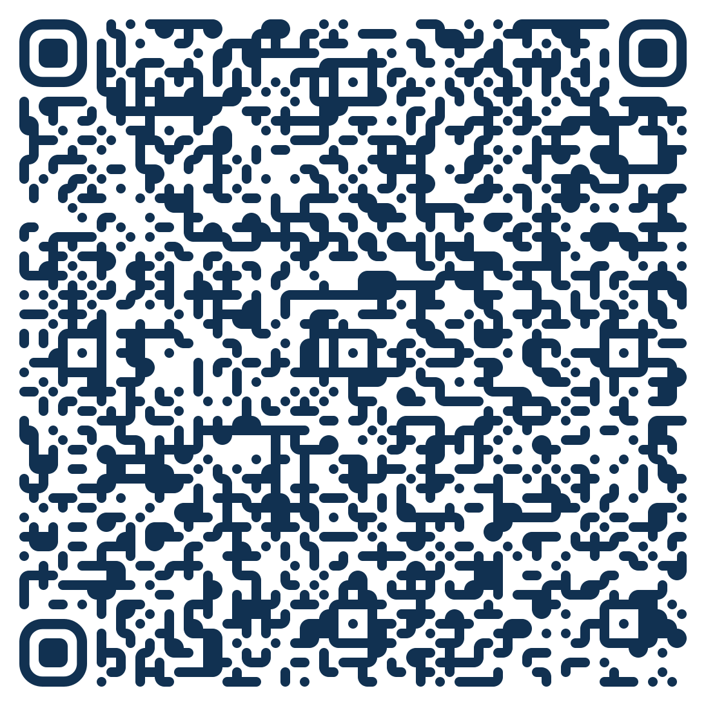
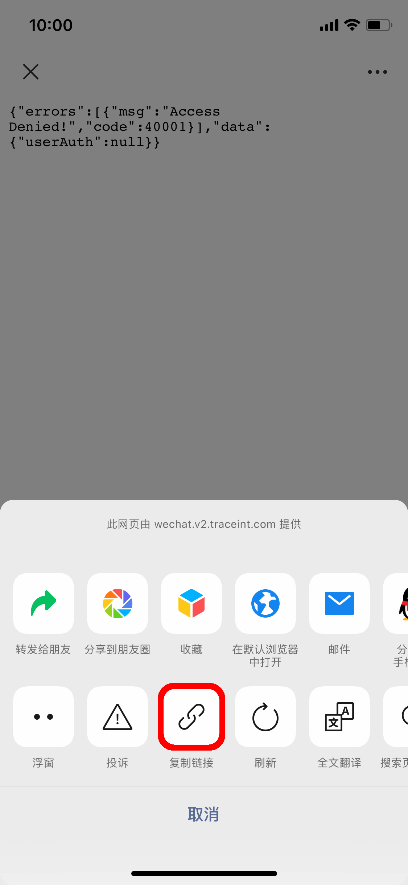
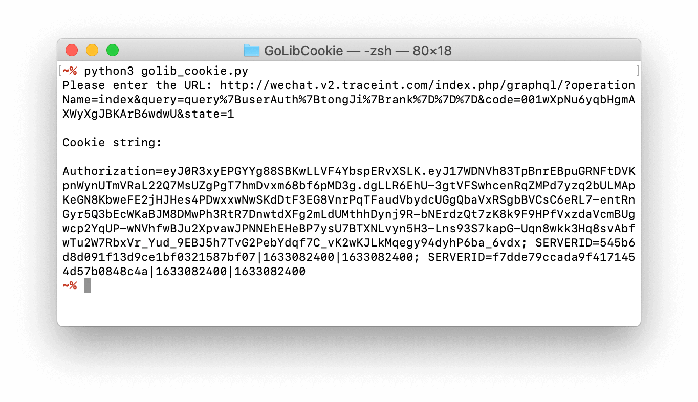
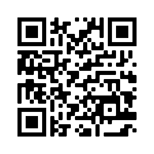

# GoLibCookie

不抓包，无代理。轻松获取「我去图书馆」微信公众号网页 Cookie。

如果您觉得本工具实用，请点击「⭐︎Star」。(￣∇￣)

## 简介

**GoLibCookie** 是一个简单的 Python 脚本。它可以在您的简单三步操作下迅速获得「我去图书馆」微信公众号网页 Cookie。

## 使用方法步骤
1. 使用微信扫描下方二维码：    

2. 点击微信右上角“…”符号，选择“复制链接”。

3. 将获得的 URL 链接，提交给 Python 脚本，即可获得 Cookie。

## 网页示例

可以将 **GoLibCookie** 应用于服务器，以便更方便与手机操作。
您可以访问[此处](http://jpn.vomega.net/golib_cookie/)，查看网页示例，或者使用手机扫描下方二维码。

## 原理

修改回调地址，手动截获微信 OAuth2.0 中的授权码。
